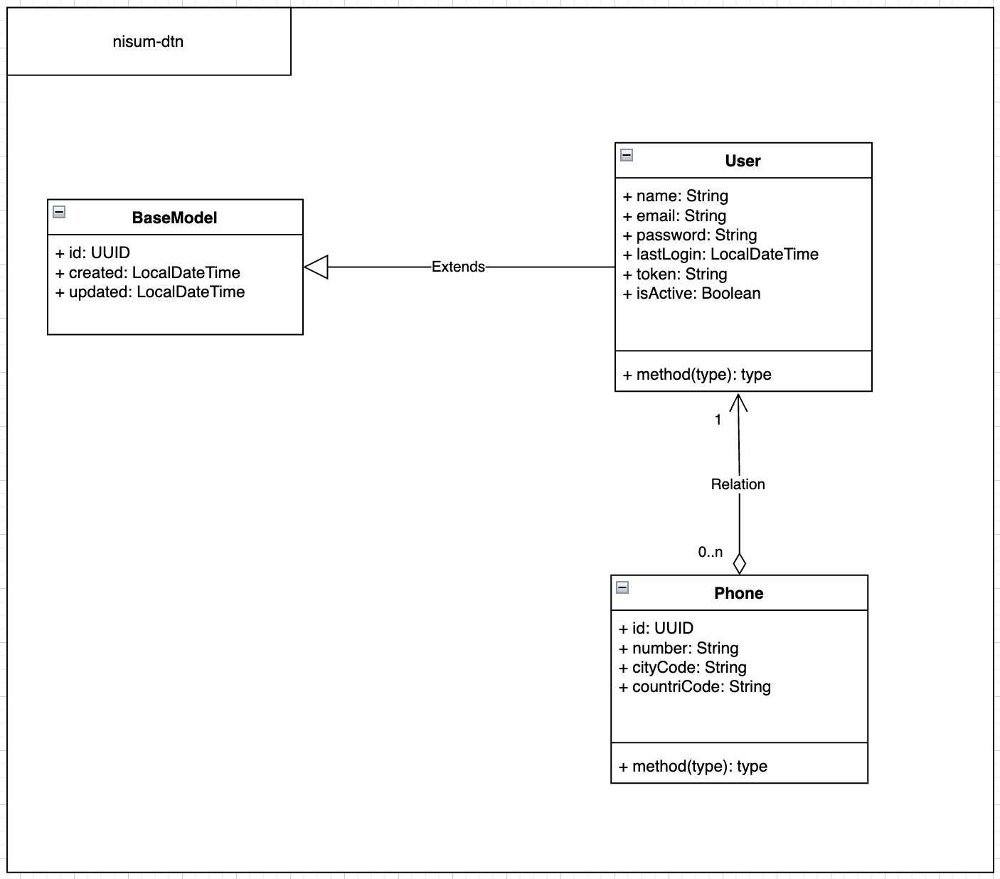
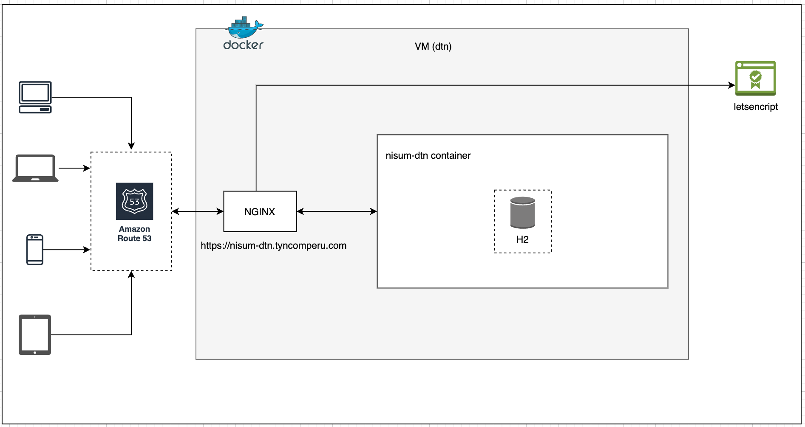
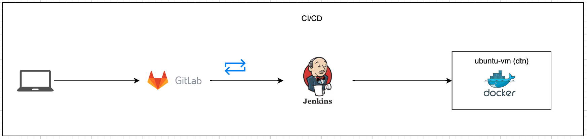

# nisum-dtn

# API RESTful de Creación de Usuarios

Este proyecto es una API RESTful desarrollada con fines académicos que permite la creación de usuarios. Todo el contenido y datos presentes en este proyecto son ficticios y no corresponden a información real.

## Tecnologías utilizadas

El proyecto ha sido desarrollado utilizando las siguientes tecnologías:

- Java
- Spring Boot 3.1.2
- JWT
- Base de datos H2 (base de datos en memoria)
- JPA
- Lombok
- MapStruct
- Spring Security
- JUnit y Mockito
- Swagger 3/Open Api
- Docker
- AWS
- Jenkins
- Certbot (Letsencrypt)
- Nginx y otros

## Diagramas

A continuación se presentan los diagramas correspondientes al diseño del proyecto.

### Diagrama de Base de Datos



### Diagrama de Componentes



### Diagrama de Despliegue



## Prueba de Endpoint

Puede probar toda la funcionalidad utilizando Swagger: [https://nisum-dtn.tyncomperu.com/swagger-ui/index.html](https://nisum-dtn.tyncomperu.com/swagger-ui/index.html).

Para registrar un usuario podría enviar este objeto en la petición POST:
```
{
    "name": "Juan Perez",
    "email": "juanperez@ejemplo.cl",
    "password":"abc2",
    "phones": [
        {
        "number": "12345678",
        "cityCode": "1",
        "countryCode": "57"
        }
    ]
}
```


